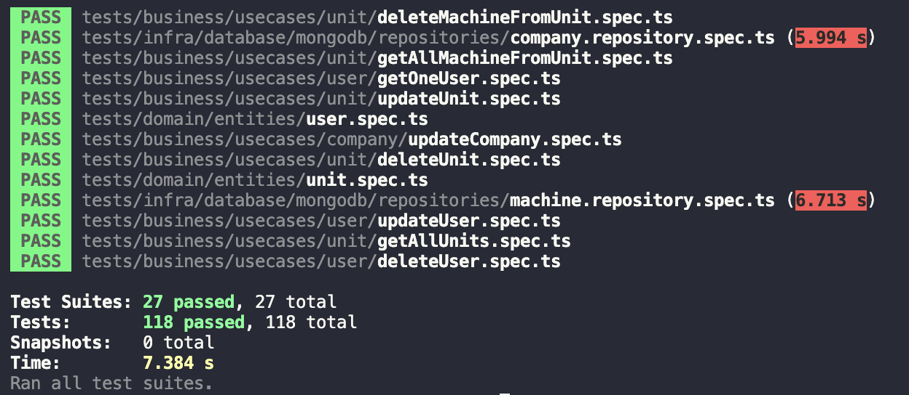

<h3 align="center">
  Backend <b>Freios Supremos<b>
</h3>

<p align="center">
  <a href="#pushpin-ferramentas-utilizadas">Ferramentas Utilizadas</a>&nbsp;&nbsp;&nbsp;|&nbsp;&nbsp;&nbsp;
  <a href="#pushpin-endpoints">Endpoints</a>&nbsp;&nbsp;&nbsp;|&nbsp;&nbsp;&nbsp;
  <a href="#pushpin-testes">Testes</a>
</p>

## Test Drive
Voce pode testar a api rodando localmente
```ssh
docker-compose up -d
```

## Ferramentas Utilizadas
* [Nodejs](https://nodejs.org/en/) -> Runtime JavaScript
* [Typescript](https://www.typescriptlang.org/) -> Superset JavaScript
* [Express](https://expressjs.com/pt-br/) -> Web Framework
* [Mongoose](https://mongoosejs.com/) -> Mongo Driver
* [Jest](https://jestjs.io/) -> Test runner
* [Docker]() -> Containerização

## Endoints
Os endpoints estão na collection Tractian-Desafio.postman_collection.json 

## Testes
Os testes podem ser executados executando o comando `npm test`
### Printscreen da execução dos testes
